# Design Document 

Authors: 
	Dalmasso Luca
    Kitou Mgbatou Osee Patrik
 	Mistruzzi Luca Guglielmo 
 	Protopapa Matteo 

Date: 30/04/2021

Version: 1.0

# Contents

- [Design Document](#design-document)
- [Contents](#contents)
- [Instructions](#instructions)
- [High level design](#high-level-design)
- [Low level design](#low-level-design)
  - [Package EZshopModel](#package-ezshopmodel)
- [Verification traceability matrix](#verification-traceability-matrix)
- [Verification sequence diagrams](#verification-sequence-diagrams)
  - [Sequence diagrams 1](#sequence-diagrams-1)
  - [Sequence diagrams 2](#sequence-diagrams-2)
    - [Sequence diagram 2.1](#sequence-diagram-21)
    - [Sequence diagram 2.2](#sequence-diagram-22)
  - [Sequence diagrams 3](#sequence-diagrams-3)
  - [Sequence diagrams 4](#sequence-diagrams-4)
    - [Sequence diagram 4.1](#sequence-diagram-41)
    - [Sequence diagram 4.2](#sequence-diagram-42)
  - [Sequence diagrams 5](#sequence-diagrams-5)
    - [Sequence diagram 5.1](#sequence-diagram-51)
  - [Sequence diagrams 6](#sequence-diagrams-6)
    - [Sequence diagram 6.2](#sequence-diagram-62)
  - [Sequence diagrams 7](#sequence-diagrams-7)
    - [Sequence diagram 7.1](#sequence-diagram-71)
  - [Sequence diagrams 8](#sequence-diagrams-8)
    - [Sequence diagram 8.2](#sequence-diagram-82)
  - [Sequence diagrams 9](#sequence-diagrams-9)
    - [Sequence diagram 9.1](#sequence-diagram-91)
  - [Sequence diagrams 10](#sequence-diagrams-10)
    - [Sequence diagram 10.2: return  cash payment](#sequence-diagram-102-return--cash-payment)

# Instructions

The design must satisfy the Official Requirements document, notably functional and non functional requirements

# High level design 

Two tiers architecture: Presentation and Logic/Data layer tied togheter

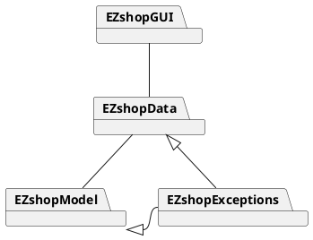

# Low level design

## Package EZshopModel

```plantuml
@startuml

scale 1.0
left to right direction

class User {
    -id : integer
    -name : String
    -password : String
    -role : String
    +User(integer id, String name, String password, String role)
    +int getID()
    +void setID(int id)
    +String getPassword()
    +void setPassword(String psw)
    +String getRole()
    +void setRole(String role)   
}

class UserList {
    -usersList : List<User>
    -authenticatedUser : User
    +UserList()
    +List<Users> getAllUsers()
    +Integer addUser(String username, String password, String role)
    +boolean deleteUser(Integer id)
    +Integer getAuthenticatedUser()
    +boolean setAuthenticatedUser(User use)
    +boolean updateUserRights (Integer id, String role)
    +boolean checkUserRights(String role)
}

class ProductTypeList {
    -productsList : List<ProductType>
    +ProductTypeList()
    +List<ProductType> getProductTypeList()
    +Integer addProductType(String description, String productCode, double pricePerUnit, String note)
    +ProductType searchProductTypeByID(Integer productID)
    +ProductType searchProductTypeByBarCode(String barCode)
    +List<ProductType> searchProductTypeByDescription(String description)
}

class CustomerList {
    -customerList : List<Customer>
    +CustomerList()
    +Customer getCustomer(Integer id)
    +List<Customer> getCustomerList()
    +Integer addCustomer(String customerName)
    +boolean updateCustomer(Integer id, String newCustomerName, String newCustomerCard)
    +boolean deleteCustomer(Integer customerID)
    +boolean attachCustomerCard((Integer id, String newCustomerCard)

}

class CardList {
    -cardList : List<LoyaltyCard>
    +CardList()
    +String addCard()
    +LoyaltyCard searchCardByID(String cardID)
    +boolean modifyPoints(String cardID, int pointsToBeAdded)

}

class CreditCardList {
    -cardList: List<CreditCard>
    +String addCard()
    +CreditCard searchCardByCode(String creditCardCode)
    +boolean checkCodeValidity(String creditCardCode)
    +boolean checkBalance(String creditCardCode, Double cost)
}

class CreditCard {
    -creditCardCode : String
    -balance : Double
    +CreditCard(String CreditCardCode, Double Balance)
    +String getCreditCardCode()
    +Double getBalance()
    +void setBalance(Double balance)
}

class SaleTransactionList {
    -saleTList : List<SaleTransaction>
    +SaleTransactionList()
    +Integer addSale()
    +SaleTransaction searchSale(Integer saleID)
    +SaleTransaction getClosedSale(Integer saleID)
    +boolean closeSale(Integer saleID)
    +boolean deleteSale(Integer saleID)
}

class ReturnTransactionList {
    -returnTList : List<ReturnTransaction>
    +ReturnTransactionList()
    +Integer addReturn(Integer transactionID)
    +ReturnTransaction searchReturn(Integer returnID)
    +boolean closeReturn(Integer returnID)
    +boolean deleteReturn(Integer returnID)
}

CreditCardList -- Shop
CreditCard "*" -- CreditCardList
ReturnTransactionList -- Shop
ReturnTransaction "*" -- ReturnTransactionList
SaleTransactionList -- Shop
SaleTransaction "*" -- SaleTransactionList
CardList -- Shop
LoyaltyCard "*" -- CardList
CustomerList -- Shop
Customer "*" -- CustomerList
ProductTypeList -- Shop
ProductType "*" -- ProductTypeList
User "*" -- UserList
UserList -- Shop


class Shop {
    -users : UserList
    -accountbook : AccountBook
    -inventory : ProductTypeList
    -orders : OrderList
    -customers : CustomerList
    -loyaltyCards : CardList
    -saleTransactions : SaleTransactionList
    -returnTransactions : ReturnTransactionList
    -creditCards : CreditCardList
    -positions : HashMap<String,boolean>
    -cardToCustomer : HashMap<CardID,CustomerID>


    +void reset()
    +Integer createUser(String username, String password, String role)
    +boolean deleteUser(Integer id)
    +List<User> getAllUsers()
    +User getUser(Integer id)
    +boolean updateUserRights(Integer id, String role)
    +User login(String username, String password)
    +boolean logout()
    +Integer createProductType(String description, String productCode, double pricePerUnit, String note)
    +boolean updateProduct(Integer id, String newDescription, String newCode, double newPrice, String newNote)
    +boolean deleteProductType(Integer id)
    +List<ProductType> getAllProductTypes()
    +ProductType getProductTypeByBarCode(String barCode)
    +List<ProductType> getProductTypesByDescription(String description)
    +boolean updateQuantity(Integer productId, int toBeAdded)
    +boolean updatePosition(Integer productId, String newPos)
    +Integer issueOrder(String productCode, int quantity, double pricePerUnit)
    +Integer payOrderFor(String productCode, int quantity, double pricePerUnit)
    +boolean payOrder(Integer transactionID)
    +boolean recordOrderArrival(Integer transactionID)
    +List<Order> getAllOrders()
    +Integer defineCustomer(String customerName)
    +boolean modifyCustomer(Integer id, String newCustomerName, String newCustomerCard)
    +boolean deleteCustomer(Integer id)
    +Customer getCustomer(Integer id)
    +List<Customer> getAllCustomers()
    +String createCard()
    +boolean attachCardToCustomer(String customerCard, Integer customerId)
    +boolean modifyPointsOnCard(String customerCard, int pointsToBeAdded)
    +Integer startSaleTransaction()
    +boolean addProductToSale(Integer transactionId, String productCode, int amount)
    +boolean deleteProductFromSale(Integer transactionId, String productCode, int amount)
    +boolean applyDiscountRateToProduct(Integer transactionId, String productCode, double discountRate)
    +boolean applyDiscountRateToSale(Integer transactionId, double discountRate)
    +int computePointsForSale(Integer transactionId)
    +boolean endSaleTransaction(Integer transactionId)
    +boolean deleteSaleTransaction(Integer transactionId)
    +SaleTransaction getSaleTransaction(Integer transactionId)
    +Integer startReturnTransaction(Integer transactionId)
    +boolean returnProduct(Integer returnId, String productCode, int amount)
    +boolean endReturnTransaction(Integer returnId, boolean commit)
    +boolean deleteReturnTransaction(Integer returnId)
    +double receiveCashPayment(Integer transactionId, double cash)
    +boolean receiveCreditCardPayment(Integer transactionId, String creditCard)
    +double returnCashPayment(Integer returnId)
    +double returnCreditCardPayment(Integer returnId, String creditCard)
    +boolean recordBalanceUpdate(double toBeAdded)
    +List<BalanceOperation> getCreditsAndDebits(LocalDate from, LocalDate to)
    +double computeBalance()
}

class AccountBook {
    -Accountinglist : List<BalanceOperation>
    -balance : Double
    +AccountBook()
    +List<BalanceOperation> getAccountinglist()
    +Double getBalance()
    +void setBalance(Double newBalance)
    +void addBalanceOperation(BalanceOperation transaction, String type, Double amount, Date date)
    +bool deleteBalanceOperation(Integer TransactionID)
}
AccountBook - Shop


class BalanceOperation {
    -transactionID : Integer
    -type : String
    -amount : Double
    -date : Date
    +BalanceOperation(Integer transactionID, String type, Double amount)
    +Integer getTransactionID()
    +String getType()
    +Double getAmount()
    +Date getDate()

}


AccountBook -- "*" BalanceOperation


class OrderList {
    -orders : List<Order>
    +OrderList()
    +List<Order> getOrders()
    +Integer addOrder(String productCode, int quantity, double pricePerUnit)
    +Order searchOrderByID(Intger transactionID)
    +Order searchOrderByFields(String productCode, int quantity, double pricePerUnit)
    +Boolean changeOrderStatus(String status)
}
OrderList -- Shop

class Order {
    -productCode : String
    -quantity : Integer
    -pricePerUnit : Double
    -state : String
    +Order(Integer transactionID, String productCode, Integer quantity, Double pricePerUnit)
    +String getProductCode()
    +Integer getQuantity()
    +Double getPricePerUnit()
    +String getState()
    +void setState(String state)
}
Order "*" -- OrderList

Order --|> BalanceOperation
SaleTransaction --|> BalanceOperation
ReturnTransaction --|> BalanceOperation


class ProductType{
    -productID : Integer
    -barCode : String
    -description : String
    -sellPrice : Double
    -quantity : Integer
    -discountRate : Double
    -notes : String
    -position : Position
    +ProductType(Integer, productID String description, String productCode, double pricePerUnit, String note)
    +Integer getProductID()
    +void setBarCode(String barCode)
    +String getBarCode()
    +void setDescription(String desc)
    +String getDescription()
    +void setSellPrice(Double price)
    +String getSellPrice()
    +void setQuantity(Integer qty)
    +String getQuantity()
    +void setDiscountRate(Double dRate)
    +String getDiscountRate()
    +void setNotes(Double dRate)
    +String getNotes()
    +void setPosition(Position position)
    +Position getPosition()
    +void updatePosition(String newPos)
}

class SaleTransaction {
    -saleList : Map<productCode, (sellPrice, quantity)>
    -status : String
    -paymentType : String
    -discountRate : Double 
    +SaleTransaction(Integer saleID)
    +Integer getsaleID() 
    +String getStatus()
    +void setStatus(String status) 
    +Double getDiscountRate() 
    +void setDiscountRate(Double discount)   
    +void addProduct(String productCode, Double sellPrice, Integer quantity)
    +boolean deleteProduct(String productCode, Integer cost)
    +Map<productCode, (sellPrice, cost)> getSaleList()
    +boolean setDiscountToProduct(String productCode, Double discount)
    +boolean modifyProductQuantity((String productCode, Integer quantity)   
}

SaleTransaction - "*" ProductType


class LoyaltyCard {
    -cardID : String
    -points : Integer
    +String getCardID()
    +void setCardID(String cardID)
    +Integer getPoints()
    +void setPoints(Integer points)
}

class Customer {
    -customerID : Integer
    -name : String
    -customerCard : String
    +Customer(Integer customerID, String name, String card)
    +Integer getCustomerID()
    +void setCustomerID(Integer customerID)
    +String getCustomerName()
    +void setCustomerName(String name)
    +String getCustomerCard()
    +void setCustomerCard(String card)

}

LoyaltyCard "0..1" - Customer

SaleTransaction "*" -- "0..1" LoyaltyCard

Order "*" - ProductType

class ReturnTransaction {
    -saleTransactionID : Integer
    -status : String
    -productCode : String
    -quantity : Integer
    +ReturnTransaction(Integer transactionID, Integer saleTransactionID)
    +String getProductCode()
    +void setProductCode(String productCode)
    +void addProduct(String productCode, Integer quantity)
}

ReturnTransaction "*" - SaleTransaction
ReturnTransaction "*" - ProductType

note "type as : CREDIT, ORDER, SALE, RETURN, DEBIT" as n1 
note "Facade class that implements\nthe EZshopInterface" as n2
note "inheritance of methods and\nattributes from BalanceOperation" as N3
N3 .. SaleTransaction
N3 .. BalanceOperation
N3 .. ReturnTransaction
N3 .. Order
n1 .. BalanceOperation
Shop .. n2

@enduml
```

# Verification traceability matrix

|       | Shop  | UserList  | User | ProductTypeList | ProductType | CustomerList | Customer | CardList | LoyaltyCard | CreditCardList | CreditCard | SaleTransactionList | SaleTransaction | ReturnTransactionList | ReturnTransaction | AccountBook | BalanceOperation | OrderList | Order |
| :-: | :-: | :-: | :-: | :-: | :-: | :-: | :-: | :-: | :-: | :-: | :-: | :-: | :-: | :-: | :-: | :-: | :-: | :-: | :-: |
| FR1    |x|x|x| | | | | | | | | | | | | | | | |
| FR3    |x|x|x|x|x| | | | | | | | | | | | | | |
| FR4    |x|x|x|x|x| | | | | | | | | | |x|x|x|x|
| FR5    |x|x|x| | |x|x|x|x| | | | | | | | | | |
| FR6    |x|x|x|x|x| | |x|x| | |x|x|x|x| | | | |
| FR7    |x|x|x| | | | | | |x|x| | | | | | | | |
| FR8    |x|x|x| | | | | | | | |x|x|x|x|x|x|x|x|

# Verification sequence diagrams 

## Sequence diagrams 1

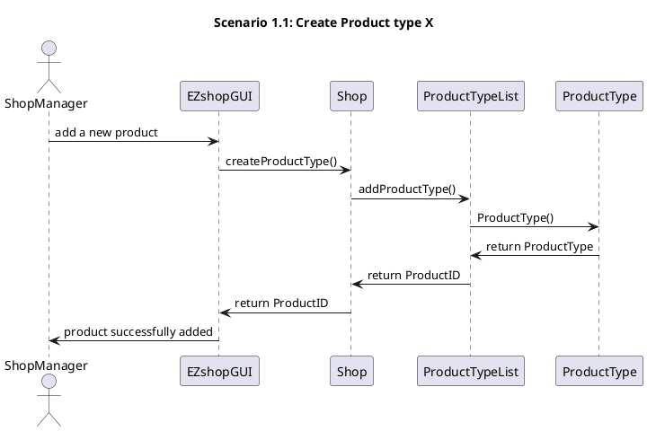

## Sequence diagrams 2
### Sequence diagram 2.1

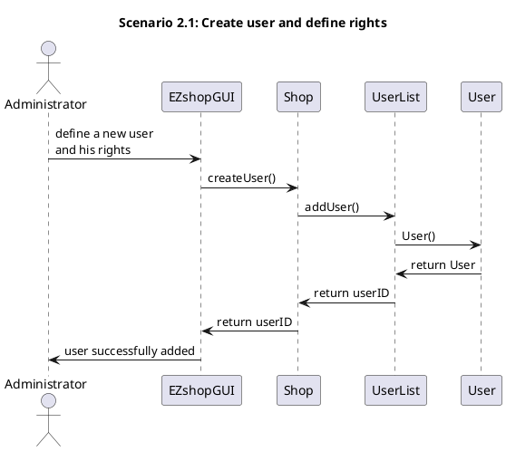

### Sequence diagram 2.2

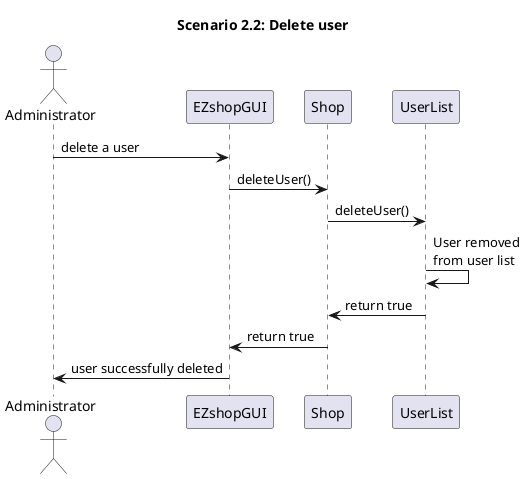

## Sequence diagrams 3

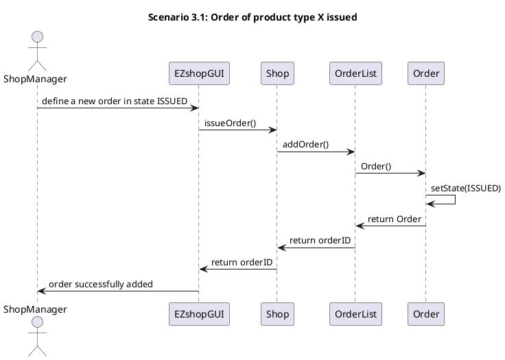

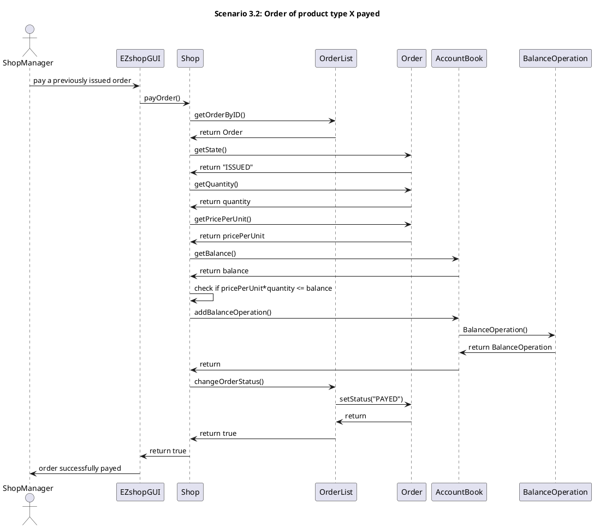

## Sequence diagrams 4

### Sequence diagram 4.1

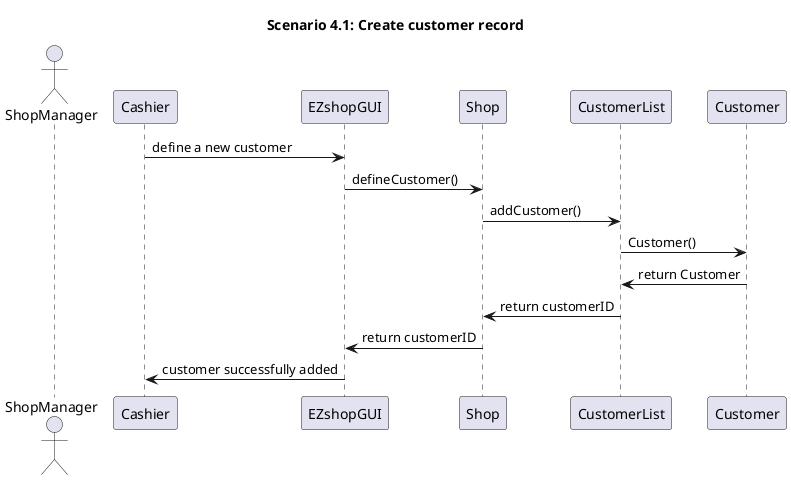

### Sequence diagram 4.2

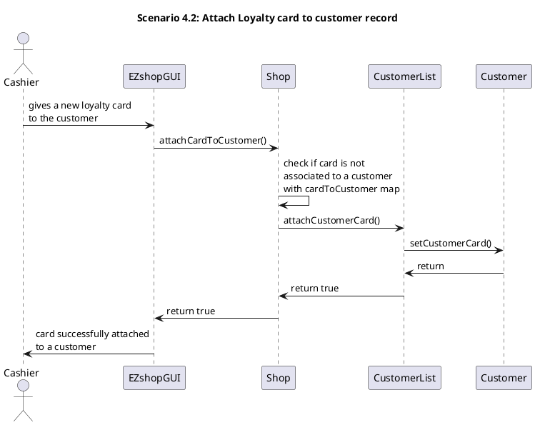

## Sequence diagrams 5

### Sequence diagram 5.1

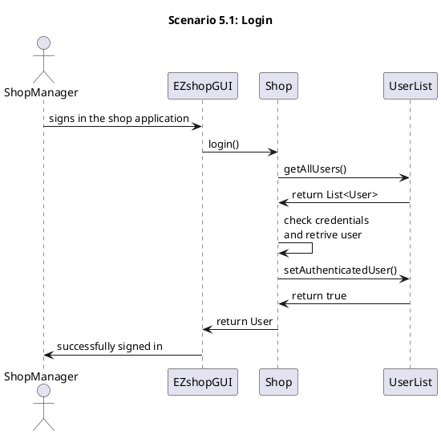

## Sequence diagrams 6

### Sequence diagram 6.2

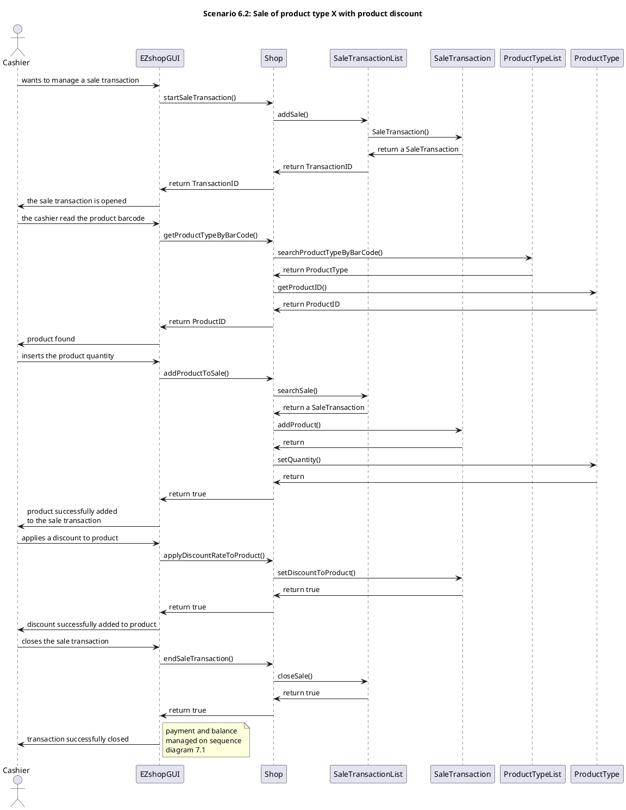

## Sequence diagrams 7

### Sequence diagram 7.1

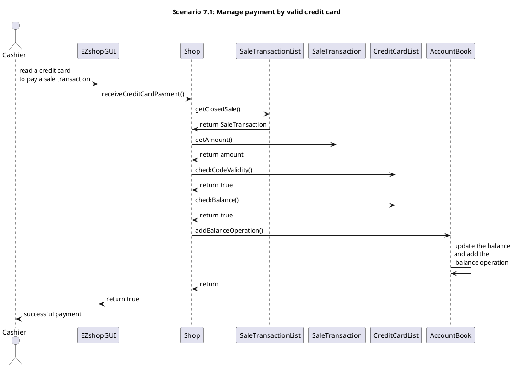

## Sequence diagrams 8

### Sequence diagram 8.2

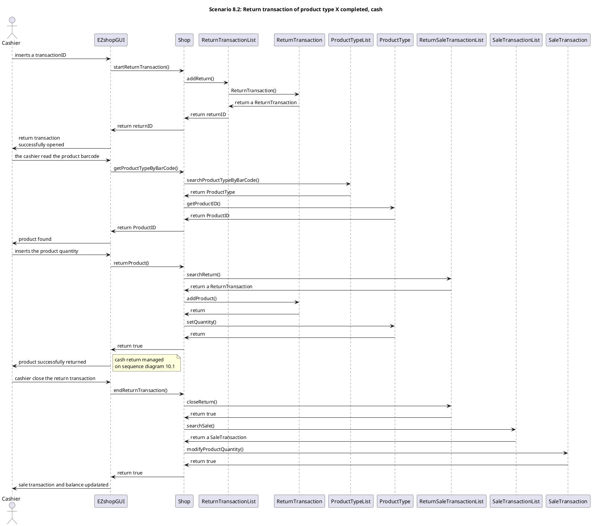

## Sequence diagrams 9

### Sequence diagram 9.1

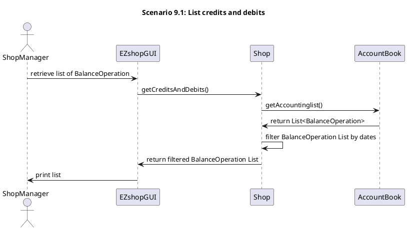

## Sequence diagrams 10

### Sequence diagram 10.2: return  cash payment

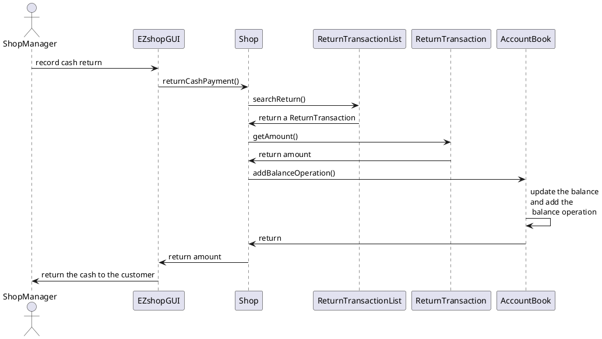