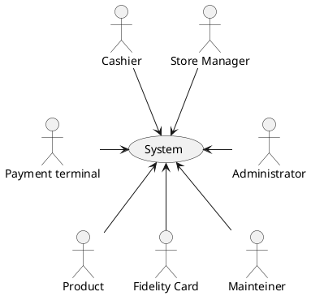
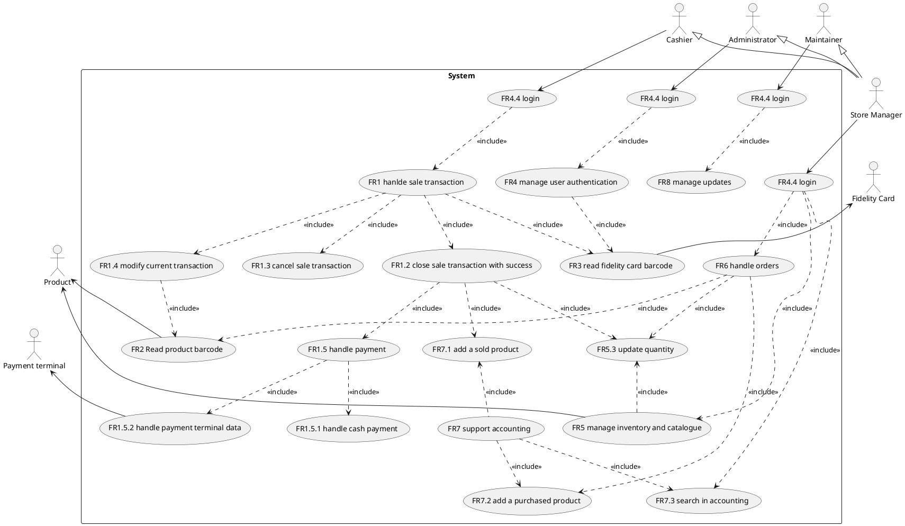
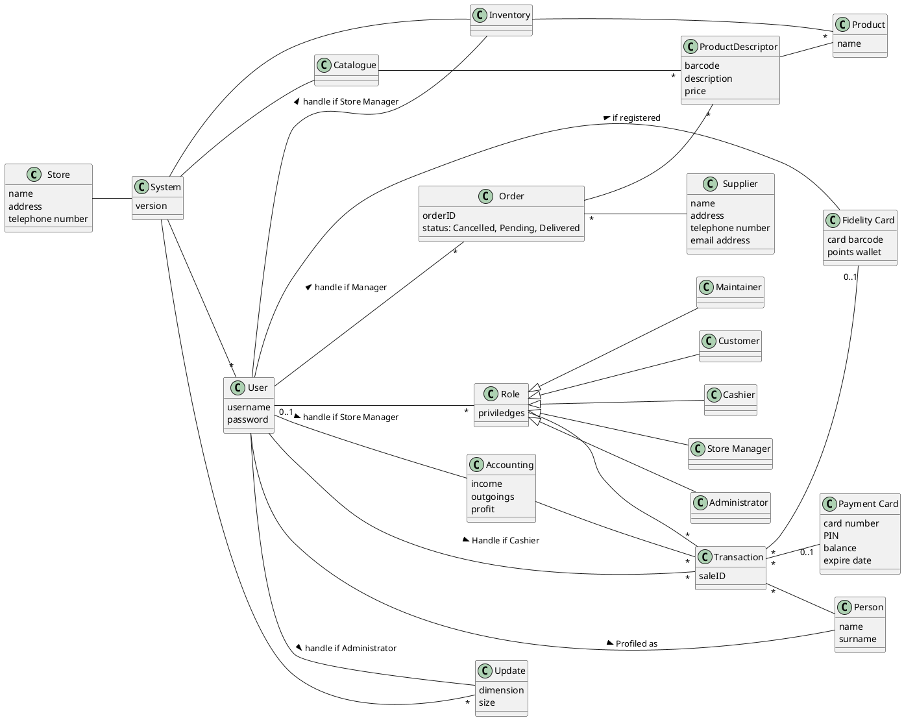
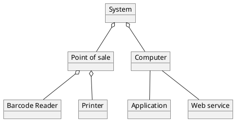
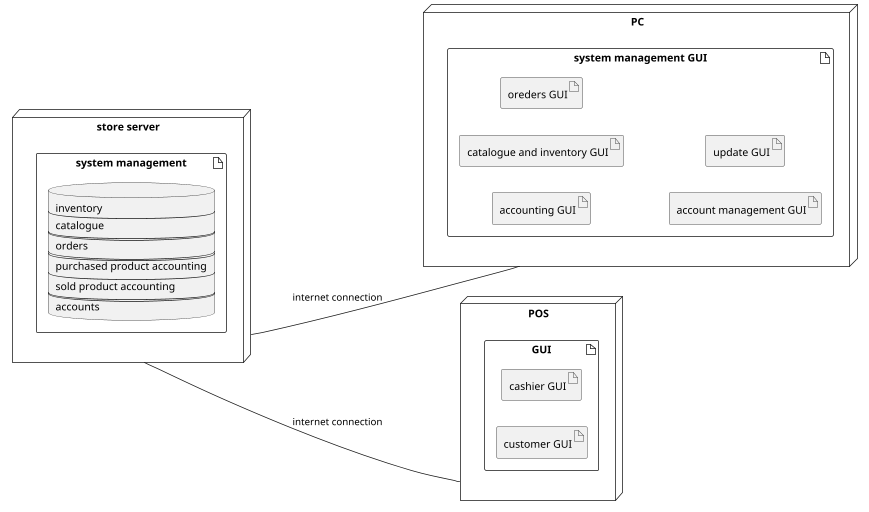

# Requirements Document 

Authors: 
 		 Dalmasso Luca 
 		 Kitou Mgbatou Osee Patrik 
 		 Mistruzzi Luca Guglielmo 
 		 Protopapa Matteo

Date: 21/04/2021

Version: 1.0

# Contents

- [Essential description](#essential-description)
- [Stakeholders](#stakeholders)
- [Context Diagram and interfaces](#context-diagram-and-interfaces)
	+ [Context Diagram](#context-diagram)
	+ [Interfaces](#interfaces) 
	
- [Requirements Document](#requirements-document)
- [Contents](#contents)
- [Essential description](#essential-description)
- [Stakeholders](#stakeholders)
- [Context Diagram and interfaces](#context-diagram-and-interfaces)
  - [Context Diagram](#context-diagram)
  - [Interfaces](#interfaces)
- [Stories and personas](#stories-and-personas)
    - [**John**](#john)
        - [Story 1](#story-1)
        - [Story 2](#story-2)
        - [Story 3](#story-3)
        - [Story 4](#story-4)
    - [**Marta**](#marta)
        - [Story 1](#story-1-1)
        - [Story 2](#story-2-1)
        - [Story 3](#story-3-1)
        - [Story 4](#story-4-1)
        - [Story 5](#story-5)
- [Functional and non functional requirements](#functional-and-non-functional-requirements)
  - [Functional Requirements](#functional-requirements)
  - [Non Functional Requirements](#non-functional-requirements)
- [Use case diagram and use cases](#use-case-diagram-and-use-cases)
  - [Use case diagram](#use-case-diagram)
    - [Manage a transaction, UC1](#manage-a-transaction-uc1)
      - [Scenario 1.1](#scenario-11)
      - [Scenario 1.2](#scenario-12)
      - [Scenario 1.3](#scenario-13)
      - [Scenario 1.4](#scenario-14)
      - [Scenario 1.5](#scenario-15)
      - [Scenario 1.6 variant](#scenario-16-variant)
    - [Manage a new fidelity card, UC2](#manage-a-new-fidelity-card-uc2)
      - [Scenario 1.1](#scenario-11-1)
    - [Manage product orders, UC3](#manage-product-orders-uc3)
      - [Scenario 1.1](#scenario-11-2)
      - [Scenario 1.2](#scenario-12-1)
      - [Scenario 1.3](#scenario-13-1)
      - [Scenario 1.4](#scenario-14-1)
    - [User Authentication, UC4](#user-authentication-uc4)
      - [Scenario 1.1](#scenario-11-3)
    - [Accounting status, UC5](#accounting-status-uc5)
      - [Scenario 1.1](#scenario-11-4)
      - [Scenario 1.2 - variant](#scenario-12---variant)
    - [System update, UC6](#system-update-uc6)
      - [Scenario 1.1](#scenario-11-5)
- [Glossary](#glossary)
- [System Design](#system-design)
- [Deployment Diagram](#deployment-diagram)

# Essential description

Small shops require a simple application to support the owner or manager. A small shop (ex a food shop) occupies 50-200 square meters, sells 500-2000 different item types, has one or a few cash registers 
EZShop is a software application to:
* manage sales
* manage inventory
* manage customers
* support accounting

# Stakeholders

| Stakeholder name    |                                                     Description                                                      |
| ------------------- | :------------------------------------------------------------------------------------------------------------------: |
| Company             |                                 the company that produces and sells the application                                  |
| Developer           |                               Who develops the application, and all the future relises                               |
| Maintainer          |                             Who updates the application whenever a new release is ready                              |
| Administrator       |                                                Who manages the users                                                 |
| Store Manager       |                                    Buyers of the application, owners of the store                                    |
| Cashier             |                         An employee who totals purchases and collects payment from customers                         |
| Warehouse worker    | employee responsible of receiving and processing incoming stock and materials, picking and filling orders from stock |
| Customer            |                                                  Buyers of products                                                  |
| Supplier            |                                          Who delivers products to the store                                          |
| Product             |                                                   Item to be sold                                                    |
| Cash                |                                       money in the form of coins or banknotes                                        |
| Payment card        |                                   a card that entitles a person to make purchases                                    |
| Payment terminal    |                                   the system to manage payment with a credit card                                    |
| Fidelity Card       |                              A card which rewards customers that make regular purchases                              |
| Internet Service Provider |       organization that provides internet service         |

# Context Diagram and interfaces

## Context Diagram

## Interfaces

| Actor            | Logical Interface | Physical Interface  |
| ---------------- | :---------------: | :-----------------: |
| Cashier          |        GUI        |     touchscreen     |
| Store Manager    |        GUI        | keyboard, mouse, PC |
| Administrator    |        GUI        | keyboard, mouse, PC |
| Mainteiner       |        GUI        | keyboard, mouse, PC |
| Product          |      barcode      |   barcode reader    |
| Payment terminal |   web services    |   ethernet cable    |
| Fidelity Card    |      barcode      |   barcode reader    |
| internet         |   web protocols   |    modem/router     |

# Stories and personas

### **John**
John is the store manager of a small shop. He works 5 days a week (from Tuesday to Saturday), from 8.00 Am to 6.00 Pm. 

##### Story 1
Every morning John opens the shop, and goes to his office. Since he needs to check the inventory and the catalogue, he logs into the application to keep track of the products of the store, so that he can contact suppliers for delivering orders.

##### Story 2
Once a week, on Friday afternoon, John needs to manage the store's accounting to keep track of the incoming, using the PC.

##### Story 3
On wednesday a young lady appeared in the shop. She, after asking to cashier that wants to be registered with a fidelity card, is sent to John's office. Here John inserts the customer data into the application and gives the card to the customer so she can proceed to purchase some goods.

##### Story 4
On saturday usually a new stock of products is delivered to John's shops. John before leaving the office would like to update the previous order in the inventory.

### **Marta**
Marta is a young 22 yold software engineering student, *very good in math*, working part-time as cashier in the store.
During the morning she follows university lectures, after that, in the afternoon, she works at the store form 2.00 Pm to 7.30 Pm. At the end of the working day, since usually is the last employee in the shop, she closes the store.

##### Story 1
Marta as always is sitting in her working place at POS, while reading the customer's products for the checkout. After some products have been read correctly, one is not read by the barcode because it's scratched. So Marta has to insert it in the cash register manually using the digits on the product, as fast as possible, because others customers are waiting in queue.

##### Story 2
Marta is interrupted by a customer while she was doing the checkout for him. The customer says that he forgotten the wallet at home, apologizing for that he helps Marta to put aside the products then he leaves the store. Marta after moving the products to put them back on the shelves, deletes the shopping list from the checkout and starts a new one for the next customers.

##### Story 3
A clumsy customer, after counting the change for a few moments, realize that doesn't have enough money to pay his bill in cash so he tells it to cashier Marta. She proceeds to change the payment method and enables the credit card terminal to complete the purchase. After successful payment the customer greets her and leaves the store.

##### Story 4
Marta, tired for the long day at university, makes a mistake and scans a product two times in a row. She realize it watching the display of the POS indicating the total quantity of the last scanned product. To solve the inconvinient the cashier has to remove from the checkout by deleting the duplicate so she can keep scanning the barcode of others products.

##### Story 5
Mark, a loyal customer and a close friend of Marta, shows up at the POS with few products to pay. Marta that knows well Mark ask him immediatly his fidelity card and scan it with the barcode reader. Then Mark ask for a discout. Marta shows him his fidelity points balance and tells him that can have a 10€ discount. Mark acept it and proceeds to pay the store bill.

# Functional and non functional requirements

## Functional Requirements

| ID        |                 Description                 |
| --------- | :-----------------------------------------: |
| **FR1**   |         **handle sale transaction**         |
| FR1.1     |            open sale transaction            |
| FR1.2     |     close sale transaction with success     |
| FR1.3     |           cancel sale transaction           |
| FR1.4     |         modify current transaction          |
| FR1.5     |               handle payment                |
| FR1.5.1   |             handle cash payment             |
| FR1.5.2   |        handle payment terminal data         |
| FR1.5.2.1 |                receive data                 |
| FR1.5.2.2 |                  send data                  |
| **FR2**   |          **read product barcode**           |
| FR2.1     |            retrieve product name            |
| FR2.2     |           retrieve product price            |
| **FR3**   |       **read fidelity card barcode**        |
| FR3.1     |          retrive customer account           |
| FR3.1.1   |                 read points                 |
| FR3.1.2   |               apply discount                |
| FR3.1.3   |                update points                |
| FR3.2     |      link barcode to customer account       |
| **FR4**   |       **manage user authentication**        |
| FR4.1     |               create account                |
| FR4.2     |               delete account                |
| FR4.3     |               modify account                |
| FR4.4     |                   log in                    |
| FR4.5     |                   log out                   |
| **FR5**   | **manage products inventory and catalogue** |
| FR5.1     |                 add product                 |
| FR5.1.1   |                add quantity                 |
| FR5.1.2   |       add purchase and selling price        |
| FR5.2     |               delete product                |
| FR5.3     |               update quantity               |
| FR5.4     |            update product price             |
| FR5.5     |               check quantity                |
| FR5.6     |               search product                |
| FR5.7     |            create products list             |
| FR5.8     |            delete products list             |
| FR5.9     |           add product to the list           |
| FR5.10    |        remove product from the list         |
| **FR6**   |         **handle suppliers order**          |
| FR6.1     |               insert an order               |
| FR6.2     |               delete an order               |
| FR6.3     |                 show orders                 |
| FR6.4     |               search an order               |
| FR6.5     |             change order status             |
| **FR7**   |           **support accounting**            |
| FR7.1     |             add a sold product              |
| FR7.1.1   |              add a date and id              |
| FR7.2     |           add a purchased product           |
| FR7.2.1   |              add a date and id              |
| FR7.3     |            search in accounting             |
| FR7.3.1   |        show income for a time period        |
| FR7.3.2   |      show outgoings for a time period       |
| FR7.3.3   |        show profit for a time period        |
| FR7.3.4   |       show income for a given product       |
| FR7.3.5   |     show outgoings for a given product      |
| FR7.3.6   |       show profit for a given product       |
| **FR8**   |             **manage updates**              |

## Non Functional Requirements

| ID    | Type (efficiency, reliability, ..) |                                   Description                                   | Refers to |
| ----- | :--------------------------------: | :-----------------------------------------------------------------------------: | :-------: |
| NFR1  |             usability              |       a cashier should be capable to use the POS GUI in less than 2 hours       |    FR1    |
| NFR2  |             usability              |        a manager should be able to manage accounts in less than 2 hours         |    FR4    |
| NFR3  |             usability              | a manager should be able to manage inventory and catalogue in less than 2 hours |    FR5    |
| NFR4  |             usability              |        a manager should be able to manage orders GUI in less than 1 hour        |    FR6    |
| NFR5  |             usability              |      a manager should be able to manage accounting GUI in less than 1 hour      |    FR7    |
| NFR6  |             usability              |    a manager should be able to learn to update system in less than 10 minute    |    FR8    |
| NFR7  |             efficency              |                   a transaction manages at most 300 products                    |    FR1    |
| NFR8  |             efficency              |             a barcode and his information must be read in <= 200ms              |    FR2    |
| NFR9  |             efficency              |                    a fidelity card must be read in <= 200ms                     |    FR3    |
| NFR10 |             efficency              |                     a user must be able to login in <= 10s                      |   FR4.4   |
| NFR11 |             efficency              |                     a user must be able to logout in <= 3s                      |   FR4.5   |
| NFR12 |             efficency              |                operations on inventory must be done in <= 100ms                 |    FR5    |
| NFR13 |             efficency              |  the inventory and the catalogue must contains a range of 500 to 2000 products  |    FR5    |
| NFR14 |             efficency              |               operations on orders table must be done in <= 100ms               |    FR6    |
| NFR15 |             efficency              |                      accounting must be computed in <= 1s                       |    FR7    |
| NFR16 |             efficency              |                   system update must be computed in <= 1 hour                   |    FR8    |
| NFR17 |             efficency              |                         system update must be <= 50 MB                          |    FR8    |
| NFR18 |              Security              |                    server stores salted hashes of passwords                     |    FR4    |
| NFR19 |              Security              |             cashier passwords must be 8 alphanumeric caracters long             |    FR4    |
| NFR20 |              Security              |            manager passwords must be 16 alphanumeric caracters long             |    FR4    |
| NFR21 |            reliability             |            operations on the inventory fails at most 1 time per year            |    FR5    |
| NFR22 |            reliability             |                profits and outcomes errors must be <= 1 per year                |    FR7    |
| NFR23 |            reliability             |                       update errors must be <= 1 per year                       |    FR8    |
| DOM1  |               domain               |                                currency is Euro                                 |    FR1    |

# Use case diagram and use cases

## Use case diagram

### Manage a transaction, UC1
| Actors Involved  |                                             Cashier, Product, Payment Card, Fidelity Card                                             |
| ---------------- | :-----------------------------------------------------------------------------------------------------------------------------------: |
| Precondition     |                                                the cashier should be logged in the POS                                                |
| Post condition   | the purchased products are added to the sold products table, the quantity of the products is updated, transaction concluded correctly |
| Nominal Scenario |                             the cashier scans products chosen by customer and closes current transaction                              |
| Variants         |              since the customer doesn't have enough credit on Payment Card, cashier needs to cancel current transaction               |

#### Scenario 1.1 

| Scenario 1.1   |                                                            transaction with cash payment                                                             |
| -------------- | :--------------------------------------------------------------------------------------------------------------------------------------------------: |
| Precondition   |                                                       the cashier should be logged in the POS                                                        |
| Post condition |        the purchased products are added to the sold products table, the quantity of the products is updated, transaction concluded correctly         |
| Step#          |                                                                     Description                                                                      |
| 1              |                                                  the cashier scan a product with the barcode reader                                                  |
| 2              |                                                           a new sale transaction is opened                                                           |
| 3              |                                                                a new list is created                                                                 |
| 4              |                                        the barcode reader retrive the name of the product from the catalogue                                         |
| 5              |                                        the barcode reader retrive the price of the product from the catalogue                                        |
| 6              |                                  the retrived information are added to the list and displayed it in the POS screen                                   |
| 7              |                                            steps 1 and 4 to 6 are repeated until all products are scanned                                            |
| 8              |                                   the POS computes the total amount of the list and displayed it in the POS screen                                   |
| 9              |                                            the chashier selects the cash payment method with the POS GUI                                             |
| 10             |                                      the cashier insert the amount of money gived by the customer with the GUI                                       |
| 11             |                                           the system evaluate the change and show it it on the POS screen                                            |
| 12             |                                                        the transaction is closed with success                                                        |
| 13             | for each product the quantity in the inventory is updated, a new record is inserted in the sold products table with the current date and a unique id |
| 14             |                                                                 the list is deleted                                                                  |

#### Scenario 1.2

| Scenario 1.2   |                                                          transaction with Payment Terminal                                                           |
| -------------- | :--------------------------------------------------------------------------------------------------------------------------------------------------: |
| Precondition   | the cashier should be logged in the POS , web services must be operative, credit card accepted by terminal (enough credit and pin digited correctly) |
| Post condition |        the purchased products are added to the sold products table, the quantity of the products is updated, transaction concluded correctly         |
| Step#          |                                                                     Description                                                                      |
| 1              |                                                  the cashier scan a product with the barcode reader                                                  |
| 2              |                                                           a new sale transaction is opened                                                           |
| 3              |                                                                a new list is created                                                                 |
| 4              |                                        the barcode reader retrive the name of the product from the catalogue                                         |
| 5              |                                        the barcode reader retrive the price of the product from the catalogue                                        |
| 6              |                                  the retrived information are added to the list and displayed it in the POS screen                                   |
| 7              |                                            steps 1 and 4 to 6 are repeated until all products are scanned                                            |
| 8              |                                   the POS computes the total amount of the list and displays it in the POS screen                                    |
| 9              |                                                         POS sends amount at payment terminal                                                         |
| 10             |                                         the chashier selects the credit card payment method with the POS GUI                                         |
| 11             |                                              the system receives a positive reply from payment terminal                                              |
| 12             |                                                        the transaction is closed with success                                                        |

#### Scenario 1.3

| Scenario 1.3   |                                             The cashier changes payment method from credit card to cash                                              |
| -------------- | :--------------------------------------------------------------------------------------------------------------------------------------------------: |
| Precondition   |                                       the cashier should be logged in the POS, web services must be operative                                        |
| Post condition |        the purchased products are added to the sold products table, the quantity of the products is updated, transaction concluded correctly         |
| Step#          |                                                                     Description                                                                      |
| 1              |                                                  the cashier scan a product with the barcode reader                                                  |
| 2              |                                                           a new sale transaction is opened                                                           |
| 3              |                                                                a new list is created                                                                 |
| 4              |                                        the barcode reader retrive the name of the product from the catalogue                                         |
| 5              |                                        the barcode reader retrive the price of the product from the catalogue                                        |
| 6              |                                  the retrived information are added to the list and displayed it in the POS screen                                   |
| 7              |                                            steps 1 and 4 to 6 are repeated until all products are scanned                                            |
| 8              |                                   the POS computes the total amount of the list and displayed it in the POS screen                                   |
| 9              |                                         the chashier selects the credit card payment method with the POS GUI                                         |
| 10             |                             the payment is refused by the terminal because there is not enough money in the credit card                              |
| 11             |                                               the cashier cancel payment card method with the POS GUI                                                |
| 12             |                                              the cashier selects cash payment method   with the POS GUI                                              |
| 13             |                                      the cashier insert the amount of money gived by the customer with the GUI                                       |
| 14             |                                           the system evaluate the change and show it it on the POS screen                                            |
| 15             |                                                        the transaction is closed with success                                                        |
| 16             | for each product the quantity in the inventory is updated, a new record is inserted in the sold products table with the current date and a unique id |
| 17             |                                                                 the list is deleted                                                                  |

#### Scenario 1.4 

| Scenario 1.4   |                                                     transaction with product inserted by mistake                                                     |
| -------------- | :--------------------------------------------------------------------------------------------------------------------------------------------------: |
| Precondition   |                   the cashier should be logged in the POS, a transaction should be opened, a product should be scanned by mistake                    |
| Post condition |        the purchased products are added to the sold products table, the quantity of the products is updated, transaction concluded correctly         |
| Step#          |                                                                     Description                                                                      |
| 1              |                                                   the cashier realizes that he/she made a mistake                                                    |
| 2              |                                            the cashier select the cancel product button from the POS GUI                                             |
| 3              |                                                     the cashier scans again the product barcode                                                      |
| 4              |                                                one occurence of the product is removed from the list                                                 |
| 5              |                                                  the cashier continues with the remaining products                                                   |
| 6              |                                   the POS computes the total amount of the list and displayed it in the POS screen                                   |
| 7              |                                            the chashier selects the cash payment method with the POS GUI                                             |
| 8              |                                      the cashier insert the amount of money gived by the customer with the GUI                                       |
| 9              |                                           the system evaluate the change and show it it on the POS screen                                            |
| 10             |                                                        the transaction is closed with success                                                        |
| 11             | for each product the quantity in the inventory is updated, a new record is inserted in the sold products table with the current date and a unique id |
| 12             |                                                                 the list is deleted                                                                  |

#### Scenario 1.5

| Scenario 1.5   |                                                transaction with fidelity card discount                                                |
| -------------- | :-----------------------------------------------------------------------------------------------------------------------------------: |
| Precondition   |               the cashier should be logged in the POS , web services must be operative, enough points on fidelity card                |
| Post condition | the purchased products are added to the sold products table, the quantity of the products is updated, transaction concluded correctly |
| Step#          |                                                              Description                                                              |
| 1              |                                          the cashier scan a product with the barcode reader                                           |
| 2              |                                                   a new sale transaction is opened                                                    |
| 3              |                                                         a new list is created                                                         |
| 4              |                                 the barcode reader retrive the name of the product from the catalogue                                 |
| 5              |                                the barcode reader retrive the price of the product from the catalogue                                 |
| 6              |                           the retrived information are added to the list and displayed it in the POS screen                           |
| 7              |                                    steps 1 and 4 to 6 are repeated until all products are scanned                                     |
| 8              |                           the POS computes the total amount of the list and displayed it in the POS screen                            |
| 9              |                                 the customer asks how many points are currently on the fidelity card                                  |
| 10             |                              the chashier checks the points amount and the discount that can be applied                               |
| 11             |                      if discounts are possible, the chashier selects the fidelity card discount with the POS GUI                      |
| 12             |                                            the points are deducted from the fidelity card                                             |
| 13             |                                       the chashier selects the payment method with the POS GUI                                        |
| 14             |                                            the payment is managed as in previous scenarios                                            |

#### Scenario 1.6 variant

| Scenario 1.6   |                      deleted transaction for not enough money                       |
| -------------- | :---------------------------------------------------------------------------------: |
| Precondition   |  the cashier should be logged in the POS, the list of scanned products is correct   |
| Post condition | the transaction is deleted, the inventory and the sold products table do not change |
| Step#          |                                     Description                                     |
| 1              |   the POS computes the total amount of the list and displays it in the POS screen   |
| 2              |            the chashier selcts the cash payment method with the POS GUI             |
| 3              |      the transaction is deleted because the customer doesn't have enough money      |
| 4              |                                 the list is deleted                                 |

### Manage a new fidelity card, UC2
| Actors Involved  |                  Store Manager, Fidelity Card                   |
| ---------------- | :-------------------------------------------------------------: |
| Precondition     |   the store manager should be logged in the management system   |
| Post condition   |          a new fidelity card is assigned to a customer          |
| Nominal Scenario | the store manager collects customer data and gives him the card |

#### Scenario 1.1 

| Scenario 1.1   |                    new fidelity card for a customer                    |
| -------------- | :--------------------------------------------------------------------: |
| Precondition   |              the store manager already log in the system               |
| Post condition | a new customer account is created, the customer recive a fidelity card |
| Step#          |                              Description                               |
| 1              |                 the store manager create a new account                 |
| 2              |             the customer data are inserted in the account              |
| 3              |   the store manager scans a brand new fidelity card with the barcode   |
| 4              |             the barcode is associated with the new accout              |
| 5              |                 the customer recives the fidelity card                 |

### Manage product orders, UC3
| Actors Involved  |                                     Store Manager                                      |
| ---------------- | :------------------------------------------------------------------------------------: |
| Precondition     |              the store manager should be logged in the management system               |
| Post condition   |                   products with small quantity  have been reordered                    |
| Nominal Scenario | the store manager consults the list of products that are ending and places their order |
| Variants         |                       The store Manager wants to cancel an order                       |

#### Scenario 1.1

| Scenario 1.1  |                         the store manager wants to place an order                          |
| ------------- | :----------------------------------------------------------------------------------------: |
| Precondition  |                  the store manager should be log in the management system                  |
| Post conditon |                       A new order should be created for the supplier                       |
| Step#         |                                        Description                                         |
| 1             |         the store manager checks products quantity using the management system GUI         |
| 2             |             the store manager place an order  using the management system GUI              |
| 3             | the store manager repeats the step 1-2 untill all the finishing products have been ordered |

#### Scenario 1.2

| Scenario 1.1  |                           the store manager wants consults an order status                           |
| ------------- | :--------------------------------------------------------------------------------------------------: |
| Precondition  |                       the store manager should be log in the management system                       |
| Post conditon |                      The manager should know the date he will receive his order                      |
| Step#         |                                             Description                                              |
| 1             |                  the store manager search an order using the management system GUI                   |
| 2             | the store manager select among the results the order of his interest using the management System GUI |
| 3             |                       the store manage can have access to details of the order                       |

#### Scenario 1.3
| Scenario 1.1  |                   the store manager wants to cancel an order                   |
| ------------- | :----------------------------------------------------------------------------: |
| Precondition  |            the store manager should be log in the management system            |
| Post conditon |       An order should be remove from the orders' tables in the Database        |
| Step#         |                                  Description                                   |
| 1             | the store manager checks if an order is active using the management system GUI |
| 2             |       the store manager delete an order  using the management system GUI       |

#### Scenario 1.4

| Scenario 1.4  |                         the manager receives a product delivery from the  supplier                         |
| ------------- | :--------------------------------------------------------------------------------------------------------: |
| Precondition  |                         the store manager, should be log in the management system                          |
| Post conditon | The Order relative to the products received must change his status to completed from the System order list |
| Step#         |                                                Description                                                 |
| 1             |                     The store manager read a product barcode using the barcode reader                      |
| 2             |              the store Manager add the product in the Inventory using add quantity System GUI              |
| 3             |        the store manager  repeats steps 1-2 untill all the products are registered in the Inventory        |
| 4             |     the store manager search the order he just received from supplier using the management system GUI      |
| 5             |       the store manager changes the status of the order to completed using the management system GUI       |

### User Authentication, UC4

| Actors Involved  |               Administrator, Store Manager, Cashier               |
| ---------------- | :---------------------------------------------------------------: |
| Precondition     |                    User knows his credentials                     |
| Post condition   | User has access to the System  and the associated functionalities |
| Nominal Scenario |                     User uses his credentials                     |

#### Scenario 1.1

| Scenario 1.1   |          Administrator logs in, add new user          |
| -------------- | :---------------------------------------------------: |
| Precondition   |     Admin already logged in with his credentials      |
| Post condition |         New profile is added into the system          |
| Step#          |                      Description                      |
| 1              | Admin inserts User's datas and associated credentials |
| 2              |           Admin choses Users's  priviledges           |
| 3              |                  Admin adds new User                  |

### Accounting status, UC5

| Actors Involved  |                                                 Store Manager                                                 |
| ---------------- | :-----------------------------------------------------------------------------------------------------------: |
| Precondition     | the tables of purchased and sold products contain up to date information, the Store Manager already logged in |
| Post condition   |                        the system shows to the Store Manager the requested information                        |
| Nominal Scenario | the Store Manager applies some filters, the requested information are displayed on the management system GUI  |
| Variants         |       the filters applied don't retrive any information, an advice appears on the management system GUI       |

#### Scenario 1.1

| Scenario 1.1   |                                  the Store Manager wants to know today income for a specific product                                   |
| -------------- | :------------------------------------------------------------------------------------------------------------------------------------: |
| Precondition   |                      Store Manager already logged in, the tables of sold products contains up to date information                      |
| Post condition |                                          today's income for the selected product is displayed                                          |
| Step#          |                                                              Description                                                               |
| 1              |                                    the Store Manager select from the GUI menu the accounting option                                    |
| 2              |                                                        the search form appears                                                         |
| 3              | the Store Manager insert product name in the search field select the filter 'by date', insert today's date and press the search button |
| 4              |                                a list of possible product is displayed in a dropdown field of the form                                 |
| 5              |                                                   the Store Manager select a product                                                   |
| 6              |                           the Store Manager select the filter to be applied in a dropdown filed of the form                            |
| 7              |                                                 the Store Manager insert today's date                                                  |
| 8              |                                             the Store Manager select the income check box                                              |
| 9              |                                               the Store Manager press the search button                                                |
| 10             |                                        today's income is displayed in the system management GUI                                        |

#### Scenario 1.2 - variant

| Scenario 1.2   |            the Store Manager wants to know today income for a specific product, the product is not being sold today             |
| -------------- | :-----------------------------------------------------------------------------------------------------------------------------: |
| Precondition   | Store Manager already logged in, the tables of sold products contains up to date information, the form search already completed |
| Post condition |                              the system doesn't find valid informations and shows a warning advice                              |
| Step#          |                                                           Description                                                           |
| 1              |                                            the Store Manager press the search button                                            |
| 2              |                                      a warning advice appears on the system management GUI                                      |

### System update, UC6

| Actors Involved  |                                                    Maintainer                                                    |
| ---------------- | :--------------------------------------------------------------------------------------------------------------: |
| Precondition     | the system is not updated, the Maintainer is logged in the system, the system have an active internet connection |
| Post condition   |                     the system is updated to the last version and ready to use in login page                     |
| Nominal Scenario |                                  the Maintainer of the system checks for update                                  |

#### Scenario 1.1 

| Scenario 1.1   |                                 system update                                 |
| -------------- | :---------------------------------------------------------------------------: |
| Precondition   | the Maintainer already log in the system, the internet conncection is working |
| Post condition |                               system is updated                               |
| Step#          |                                  Description                                  |
| 1              |  the Maintainer open the update window and clicks on check for update button  |
| 2              |   the system contact the company's server to download the update installer    |
| 3              |        the system install automatically the updtate and restart itself        |

# Glossary

# System Design

# Deployment Diagram 

